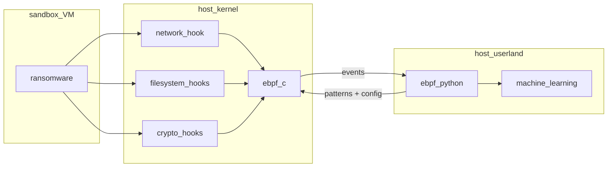
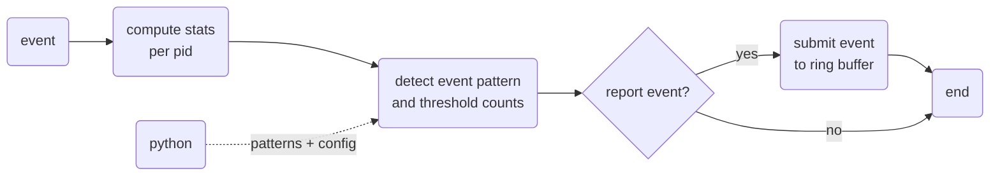

# EPITA-ebpf-detection - Ransomware Detection using Machine Learning with eBPF for Linux

Authors: Max Willers, Tomás Philippart

## Overview

This project is based on a paper written by 
Max Willers, Tomás Philippart which you can find [here](https://github.com/TomasPhilippart/ebpfangel/blob/main/docs/Ransomware_Detection_using_Machine_Learning_with_eBPF.pdf).  
The paper written by Max Willers and Tomás Philippart talks about the creation of a ransomeware detector using ebpf using machine learning. The paper on their realization highlighted a number of limitations, including data imbalance. Indeed, modeling data on ransomeware behavior can be tedious, given that you need to launch ransomeware in order to analyze its behavior.  
As part of our project, we decided to take up this challenge by following two distinct but overlapping paths.

The first is to generate more ransomeware data by using many more ransomewares.
The second is to use unbalanced data management methods.

Paper: https://github.com/TomasPhilippart/ebpfangel/blob/main/docs/Ransomware_Detection_using_Machine_Learning_with_eBPF.pdf

## Software architecture

### eBPF C program

## Learning resources and references

1. UNVEIL: A Large-Scale, Automated Approach to Detecting Ransomware
2. Toward A Network-Assisted Approach for Effective Ransomware Detection
3. Software-Defined Networking-based Crypto Ransomware Detection Using HTTP Traffic Characteristics
4. Ransomware Detection and Classification Strategies
5. Ransomware Detection techniques in the Dawn of Artificial Intelligence: A Survey
6. PayBreak: Defense Against Cryptographic Ransomware
7. Checking yourcryptography usage with eBPF (redhat, devconf 2020)
8. A Multi-Classifier Network-based Crypto Ransomware Detection System: A Casestudy of Locky Ransomware
9. A flow-based IDS using Machine Learning in eBPF
10. Kernel-level tracing for detecting stegomalware and covert channels in Linux environments
11. CryptoLock (and Drop It): Stopping Ransomware Attacks on User Data
12. https://www.bleepingcomputer.com/news/security/linux-version-of-rtm-locker-ransomware-targets-vmware-esxi-servers/ 
    https://blogs.vmware.com/security/2022/02/avoslocker-modern-linux-ransomware-threats.html
    https://www.uptycs.com/blog/rtm-locker-ransomware-as-a-service-raas-linux (see yara rule)
